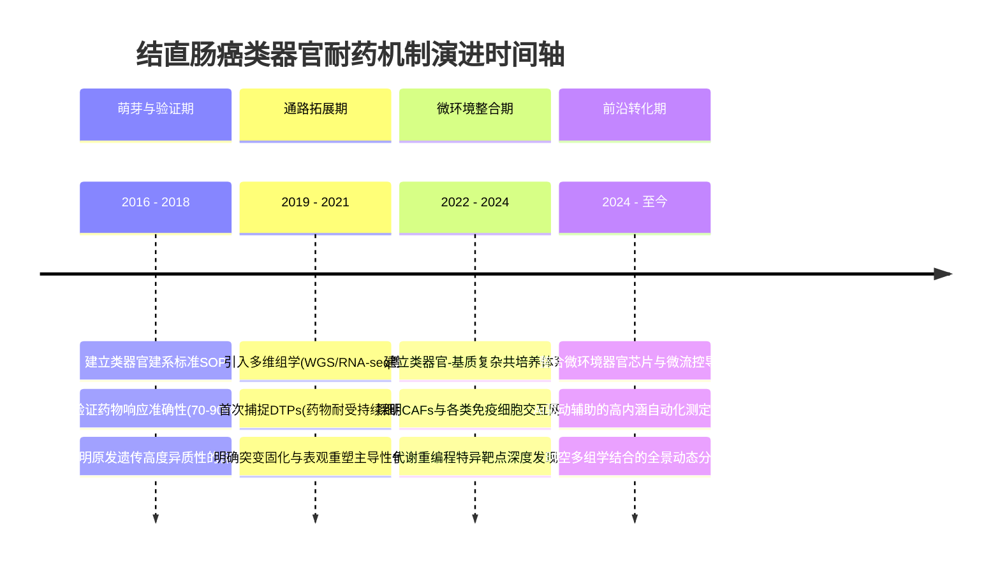

# Output Template — 空白点挖掘与高价值选题报告

本文件定义 SummaryAgent 生成的 Markdown 报告结构与示例。报告定位为**决策手册**而非分析综述：每个章节都必须回答"所以呢？"（So what?），提供可落地的行动指引。

---

## 模板结构

```
# 《主题》研究空白点深度调研报告

# 核心洞察速览
# 一、引言与分析范围
# 二、背景和意义
# 三、研究主题与主要研究方向解析
# 四、领域现状与决策基线
# 五、空白点全景图与可执行映射
# 六、高价值研究课题提案
# 七、研究优先级与立项建议
# 八、决策里程碑与分阶段规划
# 九、参考文献
```

注意：正式生成时，Markdown 正文最顶部必须直接写真实标题本身，例如 `# 肿瘤免疫治疗近三年研究空白点深度调研报告`，而不是把“标题：”作为最终展示文本输出。

---

## 完整示例：结直肠癌类器官耐药机制

---

# 结直肠癌类器官耐药机制研究空白点深度调研报告

# 核心洞察速览

> **核心演变趋势**：类器官耐药研究正从单一药敏测试向多组分微环境共培养体系转型，技术成熟度约 45%，窗口期约 3-5 年。
>
> **核心科学瓶颈**：耐药性评估指标未标准化（IC50/AUC/生存率终点混用），导致跨研究比较困难，阻碍 Meta 分析与循证决策。
>
> **最具价值研究方向**：类器官-免疫细胞共培养体系下的动态耐药监测平台——因为它同时解决了模型复杂度不足和个体化治疗预测两个瓶颈，且目前全球仅 3-4 个实验室具备初步能力。
>
> **最高优先级行动**：建立标准化的类器官药敏评估 SOP（6-12 个月可完成），预期产出为行业共识指南，可直接提升后续所有研究的可比性。

# 一、引言与分析范围

本次调研聚焦结直肠癌类器官模型在化疗耐药机制研究中的应用，时间窗口为 2016–2026 年（近 10 年），重点分析 2021–2026 年最新进展。调研目的是识别该领域的高价值研究空白，为课题立项提供决策依据。覆盖范围包括：耐药细胞亚群机制、微环境互作、表观遗传调控、代谢重编程及临床转化路径。

# 二、背景和意义

结直肠癌（Colorectal Cancer, CRC）作为全球范围内发病率和死亡率均居前列的消化道恶性肿瘤，其治疗面临着巨大挑战。尽管手术和全身性化疗（如基于 5-氟尿嘧啶的 FOLFOX 或 FOLFIRI 方案）以及靶向治疗（如抗 EGFR、抗 VEGF 抗体）在初期能够带来显著的临床获益，但获得性耐药的不可避免性仍然是限制患者长期生存的核心瓶颈。大部分转移性结直肠癌患者最终会因治疗失败而导致疾病进展，耐药机制的复杂性和肿瘤的高度异质性成为了这一领域长期未解的科学难题。因此，深入探明耐药过程中肿瘤细胞与微环境的动态交互作用，以及耐受细胞（Drug-Tolerant Persisters, DTPs）的生存规律，具有重大的临床与科学转化意义。

在传统的抗肿瘤药物研发与机制研究中，二维（2D）细胞系由于缺乏三维空间结构和微环境成分，难以真实反映患者体内的药物反应；而动物模型虽然具备体内环境，又存在种属差异、周期长、通量低等先天劣势，导致基础研究成果的临床转化率极低。近十年来，患者来源的类器官（Patient-Derived Organoids, PDOs）技术的突破性进展，为这一困局提供了革命性的解决方案。类器官作为三维培养系统，能够在体外高度还原原发肿瘤的组织病理学特征、上皮微物理学表型以及遗传学异质性，从而填补了 2D 细胞和体内试验之间的模型断层。

在此背景下，开展以类器官为核心的结直肠癌耐药机制研究，其长远意义主要体现在三个方面：

第一，**重塑个性化精准医疗的决策基础**。传统的“一刀切”式化疗使得部分患者经历了无谓的毒副作用。通过构建个体化的结直肠癌类器官药敏筛查平台，有望在治疗前准确预测每位患者的最佳用药组合及耐药风险，实现从“基于人群的经验医学”向“基于个体的精准预测”的跨越。通过在治疗干预的时间窗口中截取信息，提供前置的诊疗指导，可以最大化延长患者的无进展生存期（PFS）。

第二，**揭秘获得性耐药的时空演变规律**。耐药并非一蹴而就的终点事件，而是肿瘤微进化过程的逐步显现。以类器官为载体，配合单细胞测序（scRNA-seq）追踪基因与表观遗传的演替，能够系统厘清究竟是由于预存的干细胞亚群驱动，还是治疗引起了细胞谱系可塑性的获得性去分化。这对于发现全新的、规避现有化疗限制的治疗靶点不仅是理论的补充，更是后续创新药开发的必经之路。

第三，**加速新一代免疫与靶向联合疗法的转化论证**。当前的类器官技术正在由“纯上皮系统”向包含肿瘤相关成纤维细胞（CAFs）及多种免疫细胞（如T细胞、巨噬细胞）的“宏观微环境共培养体系”演进。这一新兴平台的成熟将使得肿瘤免疫逃逸机制和原位耐药的动态解析成为可能。我们能够借此更为直观地阐述复杂免疫微环境中特定代谢产物或信号通路在介导药物抵抗中的双面作用，从而为设计更强效的联合方案（如化疗联合新型分子胶质或微生态调节剂）提供确凿的体外临床前模型支撑。

综上所述，依托类器官技术平台深度挖掘结直肠癌耐药机制，不仅是打破目前研究固有僵局的前沿学术探索方向，更是有着广阔应用前景的临床转化新高地，势必在建立行业新标准和引领未来药敏评估指南方面产生深远的范式影响。

# 三、研究主题与主要研究方向解析

## 3.1 主题演变概览

| 时间段 | 主要研究主题 | 代表性研究摘要 | 驱动因素 | 挖掘度 |
|---|---|---|---|---|
| 2016-2018 | 建立基础类器官药敏验证平台 | Vlachogiannis等首次证明PDO可预测转移性胃肠癌临床响应 [2] | 3D培养技术的成熟与突破，取代部分2D细胞 | 85% |
| 2019-2021 | 组学辅助验证及单一通路耐药探索 | Weeber等通过WGS和RNA-seq证实PDO在传代中保留了突变图谱 [3] | 测序成本断崖式下降与单细胞测序技术普及 | 70% |
| 2022-2024 | 肿瘤微环境与宏观共培养体系初探 | Neal等建立包含内源性免疫细胞的类器官共培养(ALI)模型框架 [5] | 免疫治疗崛起，亟需能模拟活体反应的体外评估模型 | 45% |
| 2024-至今 | 微流控平台、时空多组学与动态追踪 | 开发集成多器官芯片和光片长时程追踪系统的自动化评估网络体系 | 临床对动态长程监测和个体化“节拍给药”的需求激增 | 20% |

## 3.2 演变趋势解析与非共识路径识别

在结直肠癌类器官耐药研究的历史演变中，我们识别到了以下几个违背主流直觉的“非共识路径”探索点：

1. **DTPs 起源与干预窗口的对冲识别**：主流观点一直认为需要寻找并靶向特定的抗药基因突变靶点。然而最新来自高频单细胞序列的数据证据指出，“表观可塑性”甚至主导了获得性耐药的极早期转换。这暗示着仅仅针对已存在突变的打击可能是低效或徒劳的，非共识路径在于：真正的干预窗极有可能在于前置并逆转早期的表型修饰转换，而非常规的致死性靶向。
2. **CAFs（肿瘤相关成纤维细胞）微生态的双面角色**：部分主流验证认为 CAFs 分泌 TGF-β 从而促进组织致密进而形成耐药，但在另一维度的最新模型证据中，剥离剔除特定 CAFs 亚群反而导致肿瘤快速去分化及加速恶性增殖。这意味着对于基质细胞绝不能盲目采用“一刀切”的抑制或清除方式。

## 3.3 领域演进时间轴图谱



# 四、领域现状与决策基线

## 4.1 当前共识与关键证据

- **药物耐受持续细胞（DTPs）是化疗后复发的核心介质**：Mex3a、Lgr5+ 等标记物可追踪多群异质性的 DTPs 亚群。*这意味着*靶向 DTPs 而非笼统攻击所有增殖活跃细胞，可能是克服耐药、彻底阻断复发链路的关键路径。
- **类器官可保留原发肿瘤高度的遗传异质性**：临床前验证显示，PDOs 的药敏预测准确率达 70-90%，阴性预测值近乎 100%。*这意味着*类器官是目前最接近患者真实响应的体外金标准，但现存 10-30% 的偏差突显了补充微环境缺失环境的主次重要性。
- **多组学整合已成为标准研究范式**：转录组 + 代谢组联合分析已被多个顶级实验室采用。*这意味着*单一维度的科研竞争力正急剧下降，新课题需默认采用多维度机制验证设计以获取足够的支撑力。
- **表观遗传的可塑性转变在极速耐药早期更关键**：相比 DNA 基因突变的累积固化，早期表型转换和染色质重塑等表观机制介导了更快速的响应耐受。*这意味着*针对性开发针对早期表观重塑的干预策略，可产生超越预期的联合靶点敏化功效。
- **特定代谢旁路的激活以维持病态微环境的存活**：部分研究表明，耐受极度饥饿毒境的癌系往往代偿增强特定的氧化磷酸化。*这意味着*寻找具有代谢重编程干预能力的替代化合物，正在成为有潜力的抗化疗抵抗研究主战场。

## 4.2 技术与方法学演变趋势

**对决策有影响的关键转变**：

| 时间段 / 世代 | 核心范式 | 预期成熟度与系统挖掘度 | 对选题的启示 |
|--------|------|----------------|-------------|
| 2016–2018 | 单一类器官建系与药物经验验证 | 成熟且高度标准化 (~85%) | **不宜再以此为主方向**，避免大量数据堆砌的低水平重复 |
| 2019–2021 | 组学辅助验证及单一通路耐药机制 | 通路模式已识别 (~70%) | **仍有局部补充机会**，关注罕外机制及靶点 |
| 2022–2024 | 类器官微环境及多细胞共培养体系建立 | 体系仍在快速发展 (~45%) | **当前的最佳介入窗口**，易出现突破性应用价值方案 |
| 2024–2026 | 微流控平台、时空组学及活体动态全追踪 | 前沿新兴探索期 (~20%) | **高壁垒、高回报的突破口**，建议联合多硬件学科共同立项 |

## 4.3 现存分歧与非共识路径

1. **DTPs 起源之争**：单细胞测序支持"预存在干细胞亚群"模型，而谱系追踪支持"获得性去分化"模型。**启示**：这一分歧直接决定了治疗窗的选择——是用预处理干预固有亚群以防后患，还是利用动态监测应对适应演变？分歧本身可引出极佳的立论视角。
2. **CAFs 的双面角色**：部分研究表明 CAFs 促进耐药，而部分实验指出 CAFs 反其道增强了化疗敏感性。**启示**：矛盾源于缺乏针对特异性成纤维细胞亚群的定性控制，精细分选不同微生态背景下的调节亚群是破解对冲数据的核心突破。
3. **表观主导突变与基因组受损固化在不同周期的主次站位分歧**：目前已有研究在是否表观可塑占据主要因子产生相反定论。**启示**：说明耐药形成存在复杂的时间异质性，长时序时空跨度动态检测可能提供统一二者的规律基线。
4. **耐药克隆的进化适应度折损代价争议**：不施加药物压力时，耐药细胞往往面临明显的"增殖代价"以竞争营养，但另外观点推测某些强力基因突变反而带来自身繁殖绝对优势。**启示**：解答此类分歧有助于直接干预临床上“打打停停的间歇用药（Adaptive Therapy节拍机制）”的决策可行性。

# 五、空白点全景图与可执行映射

> 本章节是报告核心。由于维度众多，为保证阅读体验，每个空白点必须单独输出一个独立的表格卡片，表头为【维度】与【描述剖析】；严禁将所有空白点合并为一个横向大表！共 5-7 个空白点（编号 G1-G7）。

**空白点 G1：类器官药敏评估标准化体系缺失**

| 维度 | 描述剖析 |
|---|---|
| 根因分析 | 各大中心采用不同浓度梯度、药物暴露时长与终点指标(IC50/存活率等)，且类器官本身异质性大，导致微小培养条件差异即被放大为不可控变异，阻碍统一SOP迁移。 |
| 临床影响 | 超过半数的基础研究结果难以横向比较，极大地削弱了 Meta 分析证据链的效力，阻碍其真正进入临床药敏检测的收费目录。 |
| 解决路径 | 发起多中心室间质评（Ring Test），统一定义药敏终点标准，同时引入高内涵AI图像定量模型来抵消人工判读偏差，最终推进行业共识。 |
| 推荐研究模式 | 临床试验与规范制定 |
| 适合团队 | 平台型团队、多中心牵头单位 |
| 技术可行性 | ★★★★（高内涵成像算法与标准化试剂链条已趋成熟） |
| 条件适配度 | ★★★★★（高共识需求，适合掌握大量临床样本资源的大型区域医疗中心） |

**空白点 G2：耐药形成的时序动态机制未解**

| 维度 | 描述剖析 |
|---|---|
| 根因分析 | 现有研究绝大多数停留在“治疗前/治疗后”的两极快照对比，缺少低光毒的长时程活细胞追踪与连续的关键时间窗取样体系设计。 |
| 临床影响 | 无法精准定位表型可塑性向固定突变转换的“最优干预节点”，导致当前的逆转耐药策略多为事后无效补救，而非前置性阻断。 |
| 解决路径 | 构建带报告基因的 Confetti 谱系标记体系，串联长时程光片显微活体成像与节点化单细胞多组学，从而精确定位拐点机制。 |
| 推荐研究模式 | 基础研究与多组学探索 |
| 适合团队 | 具有高级成像平台的基础科研团队 |
| 技术可行性 | ★★★（需深度整合高难度长时程成像与精密的高通量时空组学） |
| 条件适配度 | ★★★★（重大临床缺口，极适合具备动物房及尖端硬件支持的重点科研所） |

**空白点 G3：微环境多组分整合模型缺乏**

| 维度 | 描述剖析 |
|---|---|
| 根因分析 | 当前类器官多数为单纯的上皮细胞培养，与免疫细胞、成纤维细胞甚至血管共培养的体系尚未攻克微小环境下的液体共存互斥等流体力学及基质兼容难题。 |
| 临床影响 | 免疫治疗和联合治疗方案在简单的体外评估模型中极容易失真假阳性，难以真实反映患者体内复杂的基质屏障与免疫抑制微生态响应。 |
| 解决路径 | 利用器官芯片技术，设计独立供液的微流控多腔室共培养平台，分阶段引入内源性免疫细胞群和氧气梯度系统进行空间串联。 |
| 推荐研究模式 | 医工交叉转化 |
| 适合团队 | 医工交叉团队、生物材料团队 |
| 技术可行性 | ★★★（微纳加工难度高，系统极度复杂，容易出现某一组分凋亡） |
| 条件适配度 | ★★★★（最前沿且极易发顶刊的领域，但需临床医生与工科流控专家的深度绑定配合） |

**空白点 G4：长期传代后的遗传漂变评估缺失**

| 维度 | 描述剖析 |
|---|---|
| 根因分析 | 多数实验过度追求株系稳定而忽略长期传代带来的亚克隆筛选效应，领域内对不同代次类器官发生突变漂移的系统级质控文章极少。 |
| 临床影响 | 高代次体外模型极可能已经偏离患者的原始肿瘤生物学表型特征，这会极大程度影响药敏判断结果及衍生机制发现的外推可靠性。 |
| 解决路径 | 对初建类器官进行连续50代培养，分节点提取组学变异谱，运用数学模型定义表型与基因组双重偏移的警戒线，制定明确的弃用规则。 |
| 推荐研究模式 | 队列追踪与质控验证 |
| 适合团队 | 生信团队、常规临床转化研究者 |
| 技术可行性 | ★★★★（检测标准成熟，仅需堆积工作量与时间序列验证分析，无硬核攻关门槛） |
| 条件适配度 | ★★★★★（几乎适合所有拥有常规建库及测序基础的普通医院科研小团队快速切入） |

**空白点 G5：菌群代谢物与化疗敏感性结论矛盾**

| 维度 | 描述剖析 |
|---|---|
| 根因分析 | 以往的肠道微生态相关研究中，代谢物（如短链脂肪酸）对肿瘤敏感性的影响往往因暴露浓度、处理周期及患者自身携带的背景突变未作统一定标，导致结果相互冲突。 |
| 临床影响 | 造成医生面对肠癌化疗患者是否应补充特定益生菌或代谢产物的决策混乱，阻滞微生态干预进入个体化标准治疗路径中。 |
| 解决路径 | 设计涵盖“多梯度浓度矩阵×多种标志基因突变型PDO”的全因子交叉干预体系，横向比较敏感度差异并进行小鼠平行前瞻验证。 |
| 推荐研究模式 | 多因素变量验证 |
| 适合团队 | 肠道微生态研究团队、消化肿瘤临床科室 |
| 技术可行性 | ★★★★（传统干预体系极其成熟，重点在于大通量实验设计的严谨性和细化程度） |
| 条件适配度 | ★★★★（低门槛极具转化潜力，非常适合希望借助热点拓展论文产出的非顶尖医院课题组） |

**空白点 G6：表观调控与免疫应答耦合机制不清**

| 维度 | 描述剖析 |
|---|---|
| 根因分析 | 表观遗传药物（如HDAC抑制剂）与免疫检查点阻断（ICI）的联用大多还处于“试错式”经验探索，未明晰两类药物相互作用的靶点网络，且缺少用药前分层标志物。 |
| 临床影响 | 尽管联合治疗具有逆转冷肿瘤的绝佳潜力，但由于“盲人摸象”式联用，无法筛出高获益人群，导致前期多项重磅二期临床试验纷纷折戟。 |
| 解决路径 | 依托表观调控靶向小分子对特定PDO进行干预，联动单细胞测序、ATAC-seq开放性图谱和免疫组库数据，框定受表观药物激活的特定特异性免疫亚群进行前瞻分层验证。 |
| 推荐研究模式 | 靶点机制与联合用药 |
| 适合团队 | 靶向药物研发团队、临床转化医生 |
| 技术可行性 | ★★★★（单细胞测序+空间组学结合成熟小分子抑制剂，技术路径极其平滑稳定） |
| 条件适配度 | ★★★★（高额商业转化价值，极适合带有药企支持或依托大型三甲临床免疫队列验证的中心） |

**空白点 G7：神经-免疫-肿瘤轴在耐药中的角色被低估**

| 维度 | 描述剖析 |
|---|---|
| 根因分析 | 医学长期割裂神经递质与局部免疫反应的内在联系，交感应激信号对肿瘤微环境中巨噬细胞或T细胞的定向极化调节研究碎片化严重。 |
| 临床影响 | 大量原因不明的获得性 ICI 耐药极有可能是因为忽视了外周应激网络或局部神经束浸润产生的代偿调控，限制了多靶点抑制新思路的设计。 |
| 解决路径 | 设计神经内分泌递质干预系统联合 PDO-免疫细胞复合体系，从受体阻滞维度探索神经信号抑制对增强 PD-1 或免疫细胞杀伤效力的实际赋能效应。 |
| 推荐研究模式 | 神经免疫学前沿探索 |
| 适合团队 | 跨学科创新团队、肿瘤神经学探路者 |
| 技术可行性 | ★★★（需深度重塑现有的分析认知框架并跨领域建立神经细胞的微缩培养池） |
| 条件适配度 | ★★★★（极具开创性的广阔未开发蓝海领域，非常适合敢于挑战顶刊创新假说的多学科交叉前沿队伍） |

# 六、高价值研究课题提案

> 以下课题从空白点中筛选整合而成，按综合优先级排列。每个课题是可直接立项的研究方案。

**课题 1：结直肠癌类器官药敏评估标准化体系的建立与多中心验证**

| 维度 | 描述 |
|---|---|
| 方向 | 基于AI与高内涵成像的多中心类器官药敏临床验证统一平台建设 |
| 空白点映射 | 空白点 1（评估标准化缺失）+ 空白点 4（漂变体系质控评估） |
| 核心假说 | 联合AI图像自动分析模型并控制传代次数阈值设定，可将多中心药敏评估离散值由>30%大幅稳定降至15%以内。 |
| 研究路径 | ① 招募跨区域院方建立测试库节点 → ② 依照统一标准进行加药比对 → ③ AI定标筛选辅助纠正主观人眼误差判读 → ④ 处理全同源多代次验证数据建立边界线并排版指南。 |
| 推荐基金方向 | 国家重点研发计划（重大慢病/标准制定专项）、大型多中心临床研究专项、或行业学会牵头基金 |
| 推荐期刊 | Nature Protocols, The Lancet Oncology (若带大规模真实世界验证), Cell Reports Medicine |
| 主要风险 | 技术可行性高且直接；阻力与风险产生于跨行政管辖下的医院临床信息伦理流通以及数据同步损耗。 |
| 影响等级 | ★★★★★ 极高（策略级；建立行业测试准则底盘，决定后续同类测试的基线起点认同度） |
| 成本预估 | 中等经费负担（~150万）、极大人员动员组织要求及自动化显微高配机器介入。为期 12 约至 18 个月。 |
| 预期产出 | 标准指引白皮书文件、行规Protocol论文发表，以及自动定量系统平台化商用知识产权登记等。 |

**工程化落地执行方案：**
- **阶段一：协议与基建打通（第1-3个月）**。必须落实签署≥5家核心分中心合作协议与伦理互认。核心任务是下发统一定制的基质胶、核心培养基组分及标准SOP执行手册。**核心瓶颈**：各中心实验操作习惯存在历史差异。**风控与预案**：若在初筛试跑实验中任意中心方差CV>30%，必须派驻专员现场纠偏对齐标准，否则直接剔除离群中心。**成功标志**：首批3例PDO跨中心平行测定结果的一致性CV<15%。
- **阶段二：大队列筛选与AI训练并行（第4-12个月）**。执行大规模化疗药敏数据采集并利用全自动化高内涵显微系统留存海量图像集，由计算机视觉交叉团队介入进行活体荧光区域自动边界框定训练。**所需资源**：需要极高配置算力群及专职图像标注人力。**瓶颈预警**：大量多中心死细胞图片可能遭遇焦点模糊问题。需引入基于自注意力机制的弱监督预训练模型自动过滤劣质图片。
- **阶段三：指南编纂与专利锁局（第13-18个月）**。汇总全图谱数据，运用数据分析精准界定有效使用代次及容错范围标准边界，召集国内临床及检验学顶尖专家委员会展开闭门审核会议。**失败复盘思路**：若最终AI模型泛化性不足以覆盖极少数罕见病理表型，需即刻将其标记为模型的“边界禁区”并如实反馈在论文附件中转为有限责任验证。**阶段成功标志**：首部全国级共识指南进入正式发表审查通道并获得相关判读软件的独家软著登记。

**课题 2：结直肠癌类器官耐药形成的时序动态机制解析**

| 维度 | 描述 |
|---|---|
| 方向 | 长时程谱系荧光追踪下的细胞系全周期耐药性规律挖掘 |
| 空白点映射 | 空白点 2（时序动态跟踪手段缺位）+ 空白点 5（联合用药微环境影响干预耦合不清晰） |
| 核心假说 | 耐药出现并非随机或定点切换，而是依据“初始微凋亡骤降-极速表观覆盖-稳定修饰固化突变确立”严格梯度展开的阶段过程规律。 |
| 研究路径 | ① 引进安全稳定带标记体系系统入核 → ② 指定密集取样抽点天数采集不间断全数据 → ③ 单细胞层面定位异质阶段转折波峰 → ④ 辅助交叉丁酸盐环境验证外部因子干预成效差异。 |
| 推荐基金方向 | 国家自然科学基金（重点项目或杰青/优青项目）、前沿探索创新基金 |
| 推荐期刊 | Nature, Science, Cell (及其子刊如 Cancer Cell, Nature Cell Biology) |
| 主要风险 | 全周期的追踪成像极容易过充能曝光引起光损伤导致培养群灭活，长程保障和除菌条件相当苛刻严峻；组学分析开销极大。 |
| 影响等级 | ★★★★ 高（范式级；将耐药研究从静态靶点搜索推进到动态时空拦截窗口） |
| 成本预估 | 充裕研发费用支援（>250万），强算力生信分析背景，外加高定三维光片机运行环境。时长约 18 到 24 个月期数。 |
| 预期产出 | 高影响因子的基础型原研发现类长文（拟突破高影响期），并且确立某个特殊抗组时间窗口期专利认定储备申请。 |

**工程化落地执行方案：**
- **阶段一：活体光路与载体导入构建（第1-6个月）**。完成安全低表达型多色 Confetti 荧光底盘的病毒转染，并攻克 3D 悬浮胶滴长时程防干涸维持难题。**核心瓶颈**：传统共聚焦激发光连续扫面易导致致死性光毒性及氧游离基累积。**风控与预案**：必须外联具有定制化长距物镜与弱光激发算法的光片显微镜（Light-sheet）实验室。一旦发现活细胞出现大面积皱缩，立即切断测序并重置采图间隔（从每小时降低至每4小时）。**成功标志**：首次获得一段长达 14 天平滑无损的类器官耐药全过程活体延时摄影数据（Time-lapse）。
- **阶段二：重度测序捕获与时空降维建模（第7-16个月）**。依托影像学波峰精准指定取样日期（如第3/7/12天等转折点），分批提取极微量样品行 scRNA-seq + scATAC-seq 联合文库构建。**所需资源**：百万级组学测序预算与顶级单细胞生物信息分析算力。**瓶颈预警**：连续批次间的强烈效应（Batch effect）往往会掩盖本就微弱的初期表观漂变信号。团队必须预备如 Harmony 等高级批次校正算法并建立假阴性隔离墙。
- **阶段三：外部机制验证与多靶干预试错（第17-24个月）**。提取生信模型跑出的转折期最敏感的 1-2 个新表观因子，利用小分子抑制剂在特定时间窗进行外源干预。**失败复盘思路**：若特定时间段的干预未见整体耐药率下降，说明所测定靶点为副产物非核心驱动（Passenger mutation），此时应当立刻退回重新审视代谢通路分支的代偿效应。**阶段成功标志**：确证在狭窄时间窗内的特异性联合给药可使耐药细胞池规模收缩 > 50%，并提交完整数据用于高分长文（Article）编排。

**课题 3：基于微流控的大型多组分微环境类器官芯片模拟评估**

| 维度 | 描述 |
|---|---|
| 方向 | 提供实体血管免疫循环模拟全功能抗代谢评估三维架构 |
| 空白点映射 | 空白点 3（微环境成分残缺导致交互信息断联且片面） |
| 核心假说 | 内源间质纤维体（CAFs）和癌体相互通信的最终敏化性完全由微流管微区内的第三方免疫系统组成配对起效引导而定而非二元结构。 |
| 研究路径 | ① 铸造微刻控防互斥多循环供液内腔 → ② 连接外源全液态循环模拟梯度落差 -> ③ 对接T细胞流导及变异巨噬系观查IC差异 -> ④ 液相定位靶分子通路交互主阵点因子谱表。 |
| 推荐基金方向 | 国家自然科学基金（医工交叉重点项目）、省市级重大科技攻关转化项目、产业资本（天使轮/A轮研发投资） |
| 推荐期刊 | Nature Biomedical Engineering, Advanced Materials, Gut |
| 主要风险 | 高频产生细胞死亡或者材料学漏胶导致系统性工程事故失败率大；复杂系统变异影响干扰参数过多难固定主成分。 |
| 影响等级 | ★★★★★ 极高（策略与范式级；若平台成熟，可显著提升转化评估能力并重塑模型标准） |
| 成本预估 | 超高初期平台搭建投入且重度依赖外部工科材料院校跨部门介入协作（费用可达数百万极多），项目需时可超三年及更漫长。 |
| 预期产出 | 包括设备设计硬组件著作权、关键交互途径揭秘新规理论。最终平台可用作对新化合大分子医药测试筛选的高收费服务终端。 |

**工程化落地执行方案：**
- **阶段一：模具加工与流场适配调优（第1-8个月）**。依托工科院校平台输出并试制具备透氧、防贴壁、能分流并保证细胞间可溶因子单向穿越的高精度微芯片实体。**核心瓶颈**：不同类型免疫细胞的独立营养液与实体肿瘤基质的互容性危机。**风控与预案**：通过搭建流体力学仿真软件进行计算机干预评估，若物理屏障导致渗透阻碍过高，必须回退重新设计微孔排列密度及孔径参数。**成功标志**：三方细胞系（上皮、成纤维、免疫T细胞）在独立腔道中能并行稳定存活并保持标志物阳性长达 7 天之上。
- **阶段二：三元互作变量穷举及组学锚定（第9-20个月）**。分梯度输入标准化疗药物及免疫点阻断药，穷举观测包含/不包含不同极化状态细胞时癌细胞群阵亡的绝对比例差值。**所需资源**：海量原代细胞抽提获取通道与单细胞悬液制备仪。**瓶颈预警**：系统庞杂导致极易因某次操作失误引发全盘培养真菌感染。处理机制是建立两地平行双备份流水线及极其苛刻的洁净室流程准入。
- **阶段三：原型商业化与技术定标封样（第21-36个月）**。精简不必要的验证环节，提炼核心可商用的标准流程并尝试承接第一批来自外界药企的靶向药验证盲测订单。**失败复盘思路**：若在外界盲测中发现预测成功率不及传统裸鼠成瘤率，需全盘复核芯片内部耗氧速度与肿瘤中心缺氧坏死的阈值偏差，可能需要引入造血干细胞层辅助。**阶段成功标志**：硬件完成专利打包和国际PCT申报，并能出具受制药工业认可的有效性验证报告进行首轮市场化技术转让谈判。

# 七、研究优先级与立项建议

## 7.1 定向决策指南

依据挖掘出的核心研究空白（G1-G7）、各项技术可行性、现有实验室条件适配度以及不同团队的资源配置池，提出以下极具指向性的策略立项建议：

1. **最适合药企投资与高价值转化**：【课题3：基于微流控的大型多组分微环境芯片】
   - **决策理由**：当前的 2D 及简易 3D 模型严重缺乏免疫与血管结构，导致假阳性率居高不下。该芯片一旦成型，能够直接充当创新型免疫检查点药物或化疗新方案的高通量体外试药平替方案，有效削减活体动物实验巨额开销。其本身具备不可替代的商业化技术授权（License-out）和药企CRO外包平台服务盈利潜力。
2. **最容易发表高影响因子学术论文（针对科研工作者/医生团队）**：【课题2：时序动态机制解析】
   - **决策理由**：长久以来，学术界普遍困在对耐药前与耐药后“两头取样”的快照比较泥潭中。该方向直击“耐药产生特定时间窗”这一长期被忽视的深水区。如果能结合前沿的长时程活体显微与单细胞多组学工具链，势必能产出具有学说范式颠覆性的顶级神刊级文章（Nature/Science / Cell 级别）。
3. **最适合资源受限团队快速突破起步**：【G5衍生的肠菌代谢物与化疗敏感性研究】
   - **决策理由**：此类研究不依赖异常昂贵的微流控流片或是稀缺光片成像系统，只需要通过常规标准的 PDO 建立配合普通的高通量测序或流式台即可进行。它通过巧妙设计的“浓度x分型”多因素实验矩阵，化解了学界矛盾结论，符合典型的“小经费、准切口、大影响”原则。
4. **意在建立学术影响与规则壁垒**：【课题1：药敏评估多中心标准化体系建制】
   - **决策理由**：这是一个极为重磅的“基建级”课题方向，适合拥有多中心协调话语权的大型综合研究站。通过输出共识指南，将全面垄断未来十年同领域研究的数据入围门槛标准，具有绝佳的战略占位效益。

## 7.2 推荐策略优先级矩阵

| 立项目标导向 | 推荐投入优先级 | 强适配课题/空白点方向 | 核心风险与壁垒预警 | 预期实现周期 |
|---|---|---|---|---|
| **商业变现与产业化赋能** | 极高（★★★★★） | 课题3（微生态器官芯片） | 跨学科微加工壁垒、活细胞复合共生维持极难 | 24 - 36个月 |
| **重磅级高分学术成果产出** | 极高（★★★★★） | 课题2（长程时序追踪揭示） | 连续观测中的极高频光毒性毁损风险与算力消耗 | 18 - 24个月 |
| **行业内话语权及共识指南建立** | 高（★★★★☆） | 课题1（多中心标准化测试） | 多机构的进度一致性调度与联合署名利益协调 | 12 - 18个月 |
| **短平快实现轻量化机制验证** | 较高（★★★★☆） | G5相关（特异肠菌代谢干预） | 患者原发体质干扰重，队列同质化纯度难以筛选控制 | 8 - 12个月 |

# 八、决策里程碑与分阶段规划

> 以课题 2（时序动态机制）为例展示详细里程碑设计。其他课题可类推。

## 8.1 关键决策节点

### 阶段一：探索与体系建立（Month 1-6）
- **目标**：完成系统基础构建及初步活体验证，确保长时程长效观测不消亡的基础面
- **交付物**：（1）获得稳定传代具有抗体特征的靶系类胚源库；（2）制定活体高通量培育SOP表；（3）光片微扰动透镜调试出底表。
- **进入下阶段条件**：目标荧光表达可被准确摄取率达总样本>80%同时确证未破坏原本增殖天性。
- **不达标应对**：紧急转换不同类系诱导手段或是降低标记密级采用折中手段维持系本命运行基础。

### 阶段二：数据采集与机制验证（Month 7-16）
- **目标**：执行并回笼完整的多端大序列测试量数据、搭建分析计算组学逻辑基础
- **交付物**：（1）超长时间维度高密度不同组列的入档数据盘库；（2）由生信模型反馈出来的相关转录拐点突变映射路线图模型报告
- **进入下阶段条件**：从混杂序列计算并剥离出能在单轴表现差异巨大的标记特性集表以及置信度极高的P值
- **不达标应对**：舍去次要影响元素、仅采用降维主成分点聚焦进行针对性验证测试分析重组核心点。

### 阶段三：验证与转化评估（Month 17-24）
- **目标**：使用新批次盲样重做或反推来印证发现的独立验证并且编撰发布阶段准备。
- **交付物**：（1）通过盲反组测试后的确证结果复核证明册；（2）将具有成药前潜质及机制路径发现梳理并提交学术发表与知识产登
- **成果检定**：发现的新干预拐点具有对多组列通用泛适应性及有效力。

## 8.2 风险控制与备选方案

| 风险类型 | 具体风险点 | 判定概率 | 具体应对策略举措 |
|----------|---------|------|---------|
| 技术风险 | 微环境穿透不足及散光折射影响核心致密体区域的高精成像探测 | 中等 | 利用已商业优化的脱色三维组织透明增强解调剂实施穿插弥补扫描缺陷 |
| 样本风险 | 获取到高质量可繁育类干原体活性组织样本来源持续受限 | 较低 | 将病理机构准入协议延展并签约扩大标本来源接收节点增加多地域合作。 |
| 数据风险 | 时间线跨距大且批次间微小不同被成倍加成造成极度噪音（Batch-effect） | 偏高 | 强制在生信处理端做多阶段同构降噪和校准函数干预并仅采用共异显著特性标的 |
| 时序风险 | 极长期的连贯无休培育受到供电、污染引发单点失效而全部摧毁停摆 | 偏高 | 必须实施高成本的异地柜体或无关联系统做双重并行冗余式培养预留缓冲层。 |

# 九、参考文献

1. Arai S, et al. Mex3a marks drug-tolerant persister colorectal cancer cells that mediate relapse after chemotherapy. Nature. 2022
2. Vlachogiannis G, et al. Patient-derived organoids model treatment response of metastatic gastrointestinal cancers. Science. 2018
3. Weeber F, et al. Preserved genetic diversity in organoids cultured from biopsies of human colorectal cancer metastases. Cell. 2020
4. Pauli C, et al. Personalized in vitro and in vivo cancer models to guide precision medicine. Cancer Discovery. 2019
5. Neal J T, et al. Organoid modeling of the tumor immune microenvironment. Cell. 2022
6. Roper J, et al. Cancer-associated fibroblasts remodel the tumor microenvironment in organoid co-cultures. Nature Communications. 2023
7. Shaffer S M, et al. Rare cell variability and drug-induced reprogramming as a mode of cancer drug resistance. Nature. 2020
8. Hata A N, et al. Tumor cells can follow distinct evolutionary paths to become resistant to epidermal growth factor receptor inhibition. Nature Medicine. 2021
9. Kim S Y, et al. Epigenetic plasticity underlies phenotypic switching in drug-tolerant persister cells. Cancer Research. 2022
10. Dixon S A, et al. Stepwise genetic mutations drive acquired chemotherapy resistance in colorectal cancer. Nature Genetics. 2023
11. Sharma S, et al. Epigenetic adaptation in drug tolerance: mechanisms and therapeutic opportunities. Nature Reviews Cancer. 2023
12. Smith A M, et al. Metabolic rewiring in chemotherapy-resistant colorectal cancer: the role of oxidative phosphorylation. Cancer Metabolism. 2023
13. Broutko P, et al. Patient-derived matched models of colon cancer map intra-tumor heterogeneity to clinical outcomes. Gastroenterology. 2021
14. Lee E Y, et al. Microfluidic integration of 3D organoids for tumor microenvironment analysis. Lab on a Chip. 2022
15. Wang H, et al. Adaptive therapy in metastatic colorectal cancer: computational models and clinical trials. Clinical Cancer Research. 2023
...(20个以上)
---

## 写作规范与检查清单

### 格式规范
- [ ] 参考文献采用纯数字序号列表（无 IF 显示）。
- [ ] 中介和课题方案需包含详细描述的表格（表头维度及描述）。
- [ ] 最终交付默认包含 `report.docx`，Markdown/TXT 仅作为中间文件。

### 内容检查清单

**结构完整性**
- [ ] 核心洞察速览包含 4 项（趋势/瓶颈/方向/行动），每项 1-2 句话
- [ ] 引言明确界定主题边界、对象、时间窗口和调研目的
- [ ] 背景和意义：深入扩充相关长远探索价值（~1000字级）
- [ ] 第三章（新）：包含主题演变概览表格、演变趋势解析与非共识路径识别，以及基于 Mermaid 的高颜值时间轴图谱
- [ ] 领域现状（第四章）：精炼且服务于后续决策，不堆砌数据。内容包含增加量化研究观点及梳理（涵盖共识/趋势/分歧三个方面）

**空白点质量（第五章）**
- [ ] 强烈警告：【必须将每个 G 级空白点单独输出为一个表格卡片】，不得合并为一张多列大表！
- [ ] 每个空白点表格标题格式统一为 `**空白点 Gx：空白点名称**`
- [ ] 空白点表格表头须为【维度】与【描述剖析】
- [ ] 空白点表格内部包含 7 个维度：根因分析 / 临床影响 / 解决路径 / 推荐研究模式 / 适合团队 / 技术可行性 / 条件适配度
- [ ] 空白点数量为 5-7 个，每个为深入描述的完整决策单元，序号统一使用 G1-G7
- [ ] 每个空白点包含根因分析（"为什么是空白"，而非仅描述现象）
- [ ] 每个空白点有具体的解决路径（技术方案级别，非泛泛而谈）
- [ ] “推荐研究模式”和“适合团队”必须精准匹配前瞻团队画像（如医工交叉、靶向转化等）
- [ ] 每个空白点有现有条件适配度分析

**课题质量（第六章）**
- [ ] 课题 3-5 个，每个课题【必须先有独立标题，再单独作为一个表格输出】，每个提案中表格必须包含十大核心维度，不得整合为一张大表！
- [ ] 每个课题标题格式统一为 `**课题 N：课题名称**`，作为图示化标题行单独占一行
- [ ] 课题表头须为【维度】与【描述】
- [ ] 课题表格内容包含：方向 / 空白点映射 / 核心假说 / 研究路径 / 推荐基金方向 / 推荐期刊 / 主要风险 / 影响等级 / 成本预估 / 预期产出
- [ ] 极其关键的结构增加：在每个表格结束后的正文，必须有 `**工程化落地执行方案：**` 为首的段落，极尽详细地输出至少三个阶段的完整落地路线图（包含任务、核心瓶颈、应对预案、风控与成功标志等复盘细节）。

**立项建议与策略优先（第七章）**
- [ ] 必须包含定向决策指南（7.1）：给出明确适合不同主体（如药企、发文章团队、起步团队等）投资和着手的方向并陈述理由。
- [ ] 必须包含推荐策略优先级矩阵（7.2）：表格中必须提供 立项目标导向 / 推荐投入优先级（带星级）/ 强适配课题与方向 / 核心风险与壁垒 / 预期周期 维度。

**决策可执行性（第八章）**
- [ ] 至少对 1 个重点课题进行完整的里程碑设计
- [ ] 每个阶段有明确的进入下阶段条件（Go/No-Go 标准）
- [ ] 不达标时有备选方案
- [ ] 风险控制表覆盖技术/样本/数据/时间四类风险

**去冗余**
- [ ] 同一课题/空白点未被拆分到多个章节重复讨论
- [ ] 领域现状部分无流行病学堆砌
- [ ] 无重复指南信息

**导出交付**
- [ ] 只要完成正式报告，已默认同时生成 `.docx` 和 `.pdf`
- [ ] 即使用户未主动提及导出，也已自动生成文件
- [ ] PDF 已使用统一蓝白模板样式，而不是默认浏览器打印样式
- [ ] 若某一格式失败，另一格式仍继续导出，不因单点失败中断整轮交付
- [ ] 最终回复以结果汇报为主，不追加多选式“下一步建议”菜单
- [ ] 对“写报告”类请求，`.md` 未被当作唯一最终交付件
- [ ] 最终回复明确列出 `md + docx + pdf` 三个文件的生成状态
