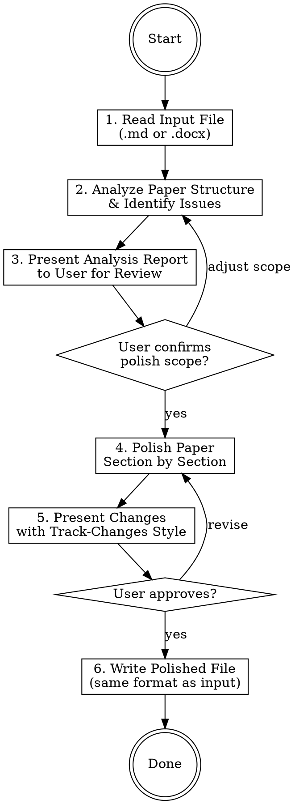

# Paper Polish - 医学论文润色

## Overview

对医学论文进行专业润色，包括语言优化、逻辑改进、学术表达规范化。支持 Markdown 和 Word (.docx) 格式的输入输出。

## When to Use

- 用户要求润色、修改、改进医学论文
- 用户提供 .md 或 .docx 格式的论文文件
- Keywords: 论文润色, 润色, polish, proofread, manuscript editing, 语言优化, 学术写作

## Process Flow



## Reading Input Files

### Markdown (.md)
Direct read with the Read tool.

### Word (.docx)
Use `python-docx` to extract text with structure preserved:

```python
from docx import Document

def read_docx(path):
    doc = Document(path)
    sections = []
    current_heading = None
    current_content = []

    for para in doc.paragraphs:
        if para.style.name.startswith('Heading'):
            if current_heading or current_content:
                sections.append({
                    'heading': current_heading,
                    'content': '\n'.join(current_content)
                })
            current_heading = para.text
            current_content = []
        else:
            if para.text.strip():
                current_content.append(para.text)

    if current_heading or current_content:
        sections.append({
            'heading': current_heading,
            'content': '\n'.join(current_content)
        })
    return sections
```

## Analysis Phase (Step 2)

Read the full paper and produce a structured analysis report covering:

### Structure Check
| Check Item | Description |
|-----------|-------------|
| Section completeness | Title, Abstract, Introduction, Methods, Results, Discussion, Conclusion, References |
| Logic flow | Each section transitions naturally to the next |
| IMRAD compliance | Follows standard medical paper structure |

### Language Issues to Identify
| Category | Examples |
|----------|---------|
| Grammar errors | Subject-verb agreement, tense consistency, article usage |
| Wordiness | "due to the fact that" → "because"; "in order to" → "to" |
| Weak expressions | "very significant" → "highly significant"; "seems to" → hedging assessment |
| Chinese-English interference | "as we all know" → remove; "more and more" → "increasingly" |
| Passive/active voice | Ensure appropriate use per journal conventions |
| Redundancy | "past history", "future prospects", "end result" |

### Medical-Specific Checks
| Category | Description |
|----------|-------------|
| Terminology consistency | Same term used throughout (e.g., don't mix "patients" and "subjects") |
| Statistical reporting | Check p-value format, CI reporting, effect sizes |
| Abbreviation rules | Define on first use, then use abbreviation consistently |
| Units & standards | SI units, proper drug naming (INN), gene/protein nomenclature (italic for genes) |
| Ethical statements | IRB/ethics approval, informed consent, trial registration mentioned |

## Analysis Report Format

Present to user as:

```markdown
## 论文润色分析报告

### 基本信息
- **标题**: [paper title]
- **类型**: [Original Article / Review / Case Report / Meta-Analysis / ...]
- **语言**: [English / Chinese / Mixed]
- **字数**: [word count]

### 结构评估
- [✓/✗] Title - [comments]
- [✓/✗] Abstract - [comments]
- [✓/✗] Introduction - [comments]
- [✓/✗] Methods - [comments]
- [✓/✗] Results - [comments]
- [✓/✗] Discussion - [comments]
- [✓/✗] References - [comments]

### 主要问题 (按严重程度排序)
1. **[Critical/Major/Minor]**: [description]
2. ...

### 润色建议范围
- [ ] 语法与拼写修正
- [ ] 学术表达优化
- [ ] 逻辑与衔接改进
- [ ] 术语一致性
- [ ] 统计报告规范化
- [ ] 格式规范化

请确认需要润色的范围，我将逐节进行修改。
```

## Polishing Phase (Step 4)

### Polishing Principles

1. **Preserve meaning**: Never change the scientific content or conclusions
2. **Minimal intervention**: Fix what's wrong, don't rewrite what's acceptable
3. **Section by section**: Polish one section at a time, present changes before moving on
4. **Track changes**: Show every change clearly so the user can accept/reject

### Section-by-Section Output Format

For each section, present changes in this format:

```markdown
## [Section Name] 润色

### 修改 1
- **原文**: "The result showed that the drug have significant effect on patients."
- **修改**: "The results showed that the drug had a significant effect on patients."
- **原因**: 主谓一致 (results→showed); 时态统一 (have→had); 冠词补充 (a significant)

### 修改 2
- **原文**: "As we all know, diabetes is a common disease."
- **修改**: "Diabetes is a prevalent chronic metabolic disorder."
- **原因**: 删除口语化表达 "As we all know"; "common disease" 改为更学术的表达
```

### Language-Specific Guidelines

#### English Medical Papers
- Use past tense for Methods and Results
- Use present tense for established facts in Introduction and Discussion
- Prefer active voice for clarity: "We measured..." over "It was measured..."
- Use hedging appropriately: "suggest", "indicate", "may", "appears to"
- Follow AMA Manual of Style conventions

#### Chinese Medical Papers (中文论文)
- 使用规范学术用语，避免口语化
- 术语参照全国科学技术名词审定委员会标准
- 数字与单位之间加空格
- 参考文献格式统一（GB/T 7714）
- 摘要结构化：目的、方法、结果、结论

## Writing Output (Step 6)

### Markdown Output
Write polished content directly using Write tool.

### Word Output
Generate polished .docx preserving original formatting:

```python
from docx import Document
from docx.shared import Pt, RGBColor
from copy import deepcopy

def write_polished_docx(original_path, output_path, polished_sections):
    """Write polished content back to docx, preserving original formatting."""
    doc = Document(original_path)

    section_idx = 0
    for para in doc.paragraphs:
        if para.style.name.startswith('Heading'):
            section_idx += 1
            continue
        # Replace paragraph text while preserving runs formatting
        if section_idx < len(polished_sections):
            if para.text.strip():
                # Preserve first run's formatting
                if para.runs:
                    fmt = para.runs[0].font
                    para.clear()
                    run = para.add_run(polished_sections[section_idx].pop(0)
                        if polished_sections[section_idx] else '')
                    run.font.size = fmt.size
                    run.font.name = fmt.name
                    run.font.bold = fmt.bold
                    run.font.italic = fmt.italic

    doc.save(output_path)
```

## Common Medical Paper Issues

### Top 10 Fixes

| # | Issue | Fix |
|---|-------|-----|
| 1 | Tense inconsistency | Past for results, present for general truths |
| 2 | "Significant" overuse | Use only when p < 0.05; otherwise "notable", "considerable" |
| 3 | Missing articles (a/the) | Common for Chinese-speaking authors; systematic check needed |
| 4 | Run-on sentences | Break into shorter, clearer sentences (aim for < 30 words) |
| 5 | Vague quantifiers | "many patients" → "78 patients (62.4%)" |
| 6 | Abbreviation chaos | First use: "Body Mass Index (BMI)"; then "BMI" only |
| 7 | Dangling modifiers | "Using western blot, the protein was detected" → "Using western blot, we detected..." |
| 8 | Figure/table references | "as shown in Fig. 1" → "as shown in Figure 1" (spell out or abbreviate consistently) |
| 9 | P-value format | "p=0.03" → "*P* = 0.03" (italic, space around =) |
| 10 | Reference format | Ensure consistent style (Vancouver for most medical journals) |

### Statistical Expression Standards

```
Correct: "The mean age was 45.3 ± 12.1 years (P = 0.003, 95% CI: 1.2–3.4)"
Wrong:   "The mean age was 45.3±12.1 years (p=.003, 95%CI 1.2-3.4)"
```

Key rules:
- P is italic: *P*
- Spaces around = and ±
- Leading zero: P = 0.003, not P = .003
- CI with colon and en-dash: 95% CI: 1.2–3.4
- Report exact P values (not just P < 0.05) when possible

## Quick Reference: Hedging Expressions

| Too Strong | Appropriate Hedge |
|-----------|-------------------|
| proves | suggests / indicates / demonstrates |
| definitely | likely / probably / potentially |
| always | frequently / typically / in most cases |
| never | rarely / seldom / infrequently |
| shows that X causes Y | suggests an association between X and Y |

## Dependencies

Ensure `python-docx` is available for Word file processing:
```bash
pip install python-docx
```
